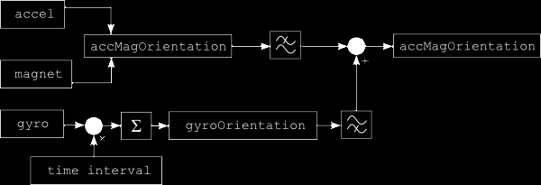
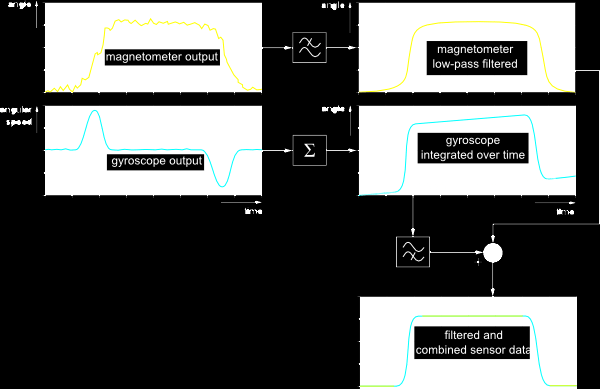

# Sensor Fusion via Complementary Filter

Before we start programming, I want to explain briefly how our sensor fusion approach works. The common way to get the attitude of an Android device is to use the `SensorManager.getOrientation()` method to get the three orientation angles. These two angles are based on the accelerometer and magnetometer output. In simple terms, the accelerometer provides the gravity vector (the vector pointing towards the center of the earth) and the magnetometer works as a compass. The Information from both sensors suffice to calculate the device's orientation. However both sensor outputs are inaccurate, especially the output from the magnetic field sensor which includes a lot of noise.

The gyroscope in the device is far more accurate and has a very short response time. Its downside is the dreaded gyro drift. The gyro provides the angular rotation speeds for all three axes. To get the actual orientation those speed values need to be integrated over time. This is done by multiplying the angular speeds with the time interval between the last and the current sensor output. This yields a rotation increment. The sum of all rotation increments yields the absolute orientation of the device. During this process small errors are introduced in each iteration. These small errors add up over time resulting in a constant slow rotation of the calculated orientation, the gyro drift.

To avoid both, gyro drift and noisy orientation, the gyroscope output is applied only for orientation changes in short time intervals, while the magnetometer/accelerometer data is used as support information over long periods of time. This is equivalent to low-pass filtering of the accelerometer and magnetic field sensor signals and high-pass filtering of the gyroscope signals. The overall sensor fusion and filtering looks like this:



So what exactly does high-pass and low-pass filtering of the sensor data mean? The sensors provide their data at (more or less) regular time intervals. Their values can be shown as signals in a graph with the time as the x-axis, similar to an audio signal. The low-pass filtering of the noisy accelerometer/magnetometer signal (accMagOrientation in the above figure) are orientation angles averaged over time within a constant time window.

Later in the implementation, this is accomplished by slowly introducing new values from the accelerometer/magnetometer to the absolute orientation:

```
// low-pass filtering: every time a new sensor value is available
// is weighted with a factor and added to the absolute orientation
accMagOrientation = (1 - factor) * accMagOrientation + factor * newAccMagValue;
```

The high-pass filtering of the integrated gyroscope data is done by replacing the filtered high-frequency component from accMagOrientation with the corresponding gyroscope orientation values:

```
fusedOrientation =
    (1 - factor) * newGyroValue;    // high-frequency component
    + factor * newAccMagValue;      // low-frequency component
```

In fact, this is already our finished complementary filter.

Assuming that the device is turned 90° in one direction and after a short time turned back to its initial position, the intermediate signals in the filtering process would look something like this:



Notice the gyro drift in the integrated gyroscope signal. It results from the small irregularities in the original angular speed. Those little deviations add up during the integration and cause an additional undesirable slow rotation of the gyroscope based orientation.