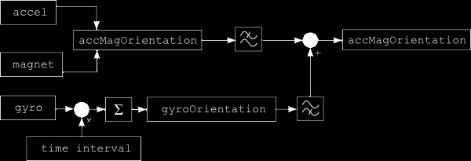
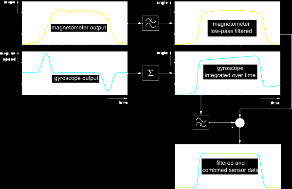

# Sensor Fusion

Sensor fusion is combining sensor data or data derived from disparate
sources such that the resulting information has less uncertainty than
would be possible when these sources were used individually.

## Simple Sensor Fusion

A FTC robot using the imu and motor encoders for odometry can improve
performance through sensor fusion.

The easiest way to go about this is with a tool known as a complimentary
filter. The complimentary filter uses a "blend" value, between 0 and 1,
to produce the output:

```java
filterOutput = blend*sensor1 + (1-blend)*sensor2;
```

Typically you have the sensor that is more reliable short term weighted
much more than the sensor that is more reliable long term. Blend values
around 0.95 are common. If you think both sensors are equally reliable,
then set blend to 0.5. This simply averages the two.

In your case you know odometry is unreliable long term because of wheel
slip and IMU short term because of delays, so I would weight odometry
0.95 and IMU 0.05 to start. See how that works and adjust as necessary.

## Sensor Fusion via Complementary Filter

This is a more complicated solution focused on the gyro and navigating.

Before we start programming, I want to explain briefly how our sensor
fusion approach works. The common way to get the attitude of an Android
device is to use the `SensorManager.getOrientation()` method to get the
three orientation angles. These two angles are based on the
accelerometer and magnetometer output. In simple terms, the
accelerometer provides the gravity vector (the vector pointing towards
the center of the earth) and the magnetometer works as a compass. The
Information from both sensors suffice to calculate the device's
orientation. However both sensor outputs are inaccurate, especially the
output from the magnetic field sensor which includes a lot of noise.

The gyroscope in the device is far more accurate and has a very short
response time. Its downside is the dreaded gyro drift. The gyro provides
the angular rotation speeds for all three axes. To get the actual
orientation those speed values need to be integrated over time. This is
done by multiplying the angular speeds with the time interval between
the last and the current sensor output. This yields a rotation
increment. The sum of all rotation increments yields the absolute
orientation of the device. During this process small errors are
introduced in each iteration. These small errors add up over time
resulting in a constant slow rotation of the calculated orientation, the
gyro drift.

To avoid both, gyro drift and noisy orientation, the gyroscope output is
applied only for orientation changes in short time intervals, while the
magnetometer/accelerometer data is used as support information over long
periods of time. This is equivalent to low-pass filtering of the
accelerometer and magnetic field sensor signals and high-pass filtering
of the gyroscope signals. The overall sensor fusion and filtering looks
like this:



So what exactly does high-pass and low-pass filtering of the sensor data
mean? The sensors provide their data at (more or less) regular time
intervals. Their values can be shown as signals in a graph with the time
as the x-axis, similar to an audio signal. The low-pass filtering of the
noisy accelerometer/magnetometer signal (accMagOrientation in the above
figure) are orientation angles averaged over time within a constant time
window.

Later in the implementation, this is accomplished by slowly introducing
new values from the accelerometer/magnetometer to the absolute
orientation:

```java
// low-pass filtering: every time a new sensor value is available
// is weighted with a factor and added to the absolute orientation
accMagOrientation = (1 - factor) * accMagOrientation + factor * newAccMagValue;
```

The high-pass filtering of the integrated gyroscope data is done by
replacing the filtered high-frequency component from accMagOrientation
with the corresponding gyroscope orientation values:

```java
fusedOrientation =
    (1 - factor) * newGyroValue;    // high-frequency component
    + factor * newAccMagValue;      // low-frequency component
```

In fact, this is already our finished complementary filter.

Assuming that the device is turned 90° in one direction and after a
short time turned back to its initial position, the intermediate signals
in the filtering process would look something like this:



Notice the gyro drift in the integrated gyroscope signal. It results
from the small irregularities in the original angular speed. Those
little deviations add up during the integration and cause an additional
undesirable slow rotation of the gyroscope based orientation.
